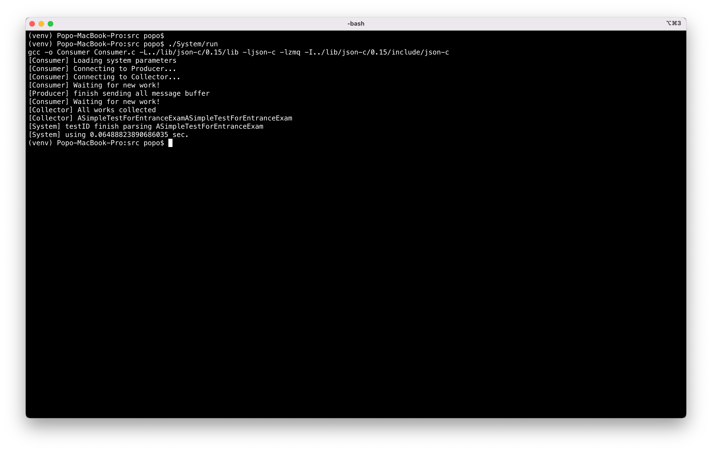

# 範例程式說明

[TOC]

## 1. 概述

在這個範例中，使用了兩種不同的 zeromq pattern ，分別是 [Push/Pull](https://learning-0mq-with-pyzmq.readthedocs.io/en/latest/pyzmq/patterns/pushpull.html) 跟 [REP/REQ](https://learning-0mq-with-pyzmq.readthedocs.io/en/latest/pyzmq/patterns/client_server.html) 。我們用這兩者建立了一個如下圖（ㄧ）的系統，在這個系統中，Producer 會將 System 指定的字串傳給 Consumer(s)，之後，Consumer(s) 將收到的字串串接，並回傳給 Collector。

* 圖一

  

## 2. 目錄結構

```c
.
+-- lib/
|		+-- json-c/0.15/	
+-- src/
|		+-- System/
|		|		+-- run
|		+-- SystemParameter.json
|		+-- Producer.py
|		+-- Consumer.py
|		+-- ResultCollector.py
|		+-- makefile
+-- requirments.txt
+-- README.md

```

| 檔案 / 目錄                  | 說明                                                         |
| ---------------------------- | ------------------------------------------------------------ |
| ```lib/json-c```             | json-c 0.15 的 library                                       |
| ```src/System/run```         | 執行檔。執行該檔案以啟動系統。                               |
| ```SystemParamter.json```    | 系統參數設定檔，其中定義了 <br />1. ```userID```：使用者 ID<br />2. ```word```：待處理的文字任務<br />3. ```num_of_consumers```：總共要開啟的 Consumer 數<br />4. ```num_to_split```：總共分成幾個子任務處理<br />5. ```socket_producer_consumer```：Producer 與 Consumer 間溝通的 port<br />6. ```socket_consumer_collector```：Consumer 與 Collector 間溝通的 port<br />7. ```socket_system_server```：Producer 與 Collector 兩者與 System 溝通的  port |
| ```src/Producer.py```        | Producer，從 System 接收處理的任務，並分配子任務給 Consumer 進行處理 |
| ```src/Consumer.c```         | Consumer，接收並處理 Producer 分配的任務，最後將其發給 Collector |
| ```src/ResultCollector.py``` | Collector，接收 Consumer 處理完的子任務                      |
| ```makefile```               | Consumer 的編譯流程                                          |
| ```requirements.txt```       | Python 檔案依賴的套件                                        |


## 3. 執行

### A. Prerequisities

* ```gcc```, ```clang```, or anothter C compiler
* ```python3.8```
  * ```virtualenv```（推薦）

#### A.1 Building virtual environment (optional)

1. 創建虛擬環境

   ```bash
   $ virtualenv venv
   ```

2. 啟用虛擬環境

   ```bash
   $ source venv/bin/activate
   ```

### B. Dependencies

* ```json-c```：相關安裝請參考 [json-c](https://json-c.github.io/json-c/json-c-0.15/doc/html/index.html) 官方網站

* ```ZeroMQ```：相關安裝請參考 [ZeroMQ](https://zeromq.org/) 官方網站
  * ```bash
    $ apt-get install libczmq-dev
    ```

* python 的相關依賴

  * ```requirements.txt```

    ```bash
    $ python3.8 install -r requirements.txt
    ```


### C. Run System
* 系統要求：Ubuntu 18.04+

在 `src/` 目錄下，執行 `./System/run`	

1. 從資料夾的根目錄移至 ```src/```

   ```bash
   $ cd src
   ```

2. 執行系統

   系統將自動編譯 Consumer.c 並依序啟動 Consumer => Collector => Producer

   ```bash
   $ ./System/run
   ```

3. 執行後，即可看到系統相關資訊，如圖 (二)

   * 圖二

     

     
